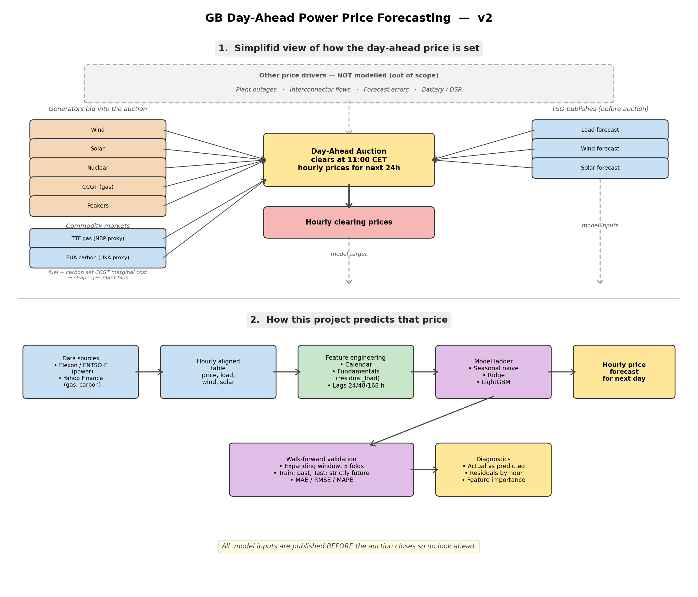

# Day-Ahead Power Price Forecasting (GB)

Forecasting next-day hourly wholesale power prices for the GB market from forecasts of system load, wind and solar. In addition current gas and carbon prices will also be used to see if there is any feature impact on prediting the day ahead

Day-ahead prices clear in a single auction at 11:00 CET each day. By that moment the market knows five things with reasonable confidence

1. **Load forecast** for tomorrow (TSO-published demand)
2. **Wind generation forecast** 
3. **Solar generation forecast** 
4. **Gas price** (TTF as a proxy for NBP — sets CCGT marginal cost)
5. **Carbon price** (KEUA ETF as a proxy for UKA — adds to CCGT marginal cost)

Together these tell the model **where on the merit-order curve the price-setting plant will sit** and roughly **what it will charge**. That makes "given tomorrow's forecasts, what will prices be?" the canonical short-term forecasting problem in this market.

In addition, features like engineers calendar and lagged-price will be added to help predict the auction's hourly clearing price. Methodology is causally honest by construction: every input is published *before* the auction it's predicting.

## Architecture 



Top half, shows how the price gets set. Generators bid, the TSO publishes day-ahead load/wind/solar forecasts, commodity markets set CCGT marginal cost, and the auction clears at 11:00 CET. 

Bottom half, the forecasting pipeline that consumes those public inputs


## Data sources

| Series | Source | Endpoint / ticker |
|---|---|---|
| `day_ahead_price` | Elexon BMRS | MID dataset, dataProvider=APXMIDP  |
| `load_forecast` | Elexon BMRS | `/forecast/demand/total/day-ahead` |
| `wind_forecast` | Elexon BMRS | WINDFOR with `publishDateTime` filter + 12h lead-time gate |
| `solar_forecast` | Elexon BMRS | AGWS actuals shifted +24h (see note below) |
| `ttf_gas` | Yahoo Finance | `TTF=F` front-month future |
| `eua_carbon` | Yahoo Finance | `KEUA` (KraneShares EUA ETF) |

Elexon BMRS is fully open and Yahoo Finance is free.

Elexon has retired its free day-ahead solar forecast endpoints. The only freely available solar series is AGWS actuals. This is a proxy by shifting timestamps forward by 24 hours, so the feature at hour T corresponds to “yesterday’s actual at T”. This information that is genuinely available ahead of the day-ahead auction but can be different to th forecast. This approach is inherently noisier than a true forecast, as it cannot capture day specific effects such as cloud cover. On production use, it should be replaced with a proper solar forecast.


## Date range — and the data-availability constraint

**Effective window: August 2023 → December 2025** (~2.5 years, ~16,000 hourly rows after merge and feature engineering).

The original target was 2021–2025 (to capture the 2022 European gas crisis as a stress test). During the build I discovered that Elexon's endpoint only retains data from ~July 2023 onwards. Older NDF day-ahead forecasts have been retired from the public API. The other layers (MID prices, WINDFOR, AGWS solar, Yahoo fuel) all have full 2021–2025 history, but the merged frame is bottlenecked by the shortest series.

notes worth flagging,

1. **It's a real data constraint, not a modelling choice**. The pipeline accepts arbitrary date windows; the binding constraint is what Elexon retains in its public API.
2. **2022 gas crisis is out of the training window.** The strongest possible stress test for the fuel features is not available. A paid feed or ENTSO-E historical archive would resolve this.
3. **2.5 years was still enough.** The post-crisis recovery (late 2023) and normalised regime (2024–25) cover meaningful gas/power dynamics.

## Methodology

| Stage | What it does | Why it matters |
|---|---|---|
| **Data layer** | Pulls hourly Elexon series + daily Yahoo Finance fuel prices, lags fuel by 1 day | Real, free, regulator/exchange-published data|
| **Features** | Calendar (hour, dow, month, weekend, holiday + sin/cos), fundamentals (residual_load, renewable_share), 24/48/168h lagged prices, 24/168h rolling stats | Captures daily/weekly cycles and the load-net-renewables signal that drives merit order; lagged prices capture autocorrelation |
| **Models** | Seasonal-naive (price 168h ago) → Ridge regression → LightGBM | Each step earns the next: the baseline anchors expectations, linear shows the structure, GBM captures non-linearity in the merit-order curve |
| **Validation** | Expanding-window walk-forward CV, 5 folds × 18 days | Prevents leakage; mirrors how a model would be retrained in production |
| **Metrics** | MAE (headline), RMSE (tail-sensitive), MAPE (with `y≥1` floor | MAE is most interpretable in £/MWh; MAPE can blow up on near-zero prices in GB |
| **Diagnostics** | Actual vs predicted, residuals by hour, gain importance, SHAP values | Catches structural bias the headline metric hides |

## Headline results

After running `scripts/03_train_evaluate.py`:

```
seasonal_naive_168h     MAE 19.58   RMSE 27.48
ridge                   MAE 14.27   RMSE 18.40   ← 27% better than naive
lightgbm                MAE 13.06   RMSE 18.15   ←  8% better than ridge
```

Final-fold LightGBM: **MAE £11.17 / RMSE £16.11** — about 15% of the £74 mean clearing price. RMSE close to MAE means errors aren't dominated by a few huge misses.

### The fuel-features ablation

Training LightGBM with vs without the gas + carbon columns:

```
fold   without_fuel   with_fuel   improvement
1         12.12         11.51        +5.05%
2         20.19         18.73        +7.25%   
3         11.04         11.78        −6.73%
4         13.10         12.13        +7.43%
5         10.69         11.17        −4.55%
                                 avg ≈ +1.7%
```


## Project structure

```
power_price_forecasting_v2/
├── config.yaml              # market, dates, fuel tickers, model hyperparameters
├── requirements.txt
├── docs/
│   ├── architecture.png     # diagram embedded in README
│   
├── src/
│   ├── data_fetch.py        # Elexon BMRS + Yahoo Finance client, with caching
│   ├── features.py          # calendar + fundamentals + lagged-price feature engineering
│   ├── models.py            # SeasonalNaive, LinearModel (ridge), LightGBMModel
│   ├── evaluate.py          # expanding-window walk-forward CV, MAE/RMSE/MAPE
│   └── plots.py             # diagnostic plots
├── scripts/
│   ├── 01_fetch_data.py     # downloads + caches raw data
│   ├── 02_build_features.py # writes data/processed/features.parquet
│   └── 03_train_evaluate.py # trains models, scores, saves figures
├── notebooks/
│   └── 01_walkthrough.ipynb # end-to-end narrative — best entry point for review
├── data/
│   ├── raw/                 # cached parquets 
│   └── processed/           # feature matrix
└── reports/figures/         # output plots
```

## Setup

```bash
pip install -r requirements.txt
```


## How to run it

```bash
python scripts/01_fetch_data.py       
python scripts/02_build_features.py   
python scripts/03_train_evaluate.py    
```


python scripts/01_fetch_data.py        #fetches data
python scripts/02_build_features.py    # writes data/processed/features.parquet
python scripts/03_train_evaluate.py    # trains all three models, saves figures


Or step through `notebooks/01_walkthrough.ipynb` for the narrated version with diagnostic plots inline. The notebook is the recommended entry point for  review. You will need to still run the above script before using the notebook


## What this model deliberately does *not* do

| Driver | Why it's out of scope |
|---|---|
| **Plant outages** | A 2 GW nuclear trip materially shifts the merit order |
| **Interconnector flows / continental prices** | GB has ~9 GW of import capacity; needs ENTSO-E for DE/FR/NL prices and capacity allocations |
| **Wind/solar forecast errors** | Pair forecast with actual, lag the residual error. captures variance in renewables performance vs published forecasts |
| **Battery / DSR participation** | Elexon publishes some battery dispatch. However, this needs mor time invested to  understand |
| **CfD bid behaviour** | Wind farms on CfDs bid negative (their revenue is the strike price, not the market). Drives most of the negative-price events in GB |
| **Strategic / pivotal-supplier bidding** | Above ~80% utilisation of the marginal CCGT, owners can exercise market power, needs plant-level positions |

These are deliberately scoped out for the first useful iteration. They're flagged in the architecture diagram's "Other price drivers — NOT modelled" callout box

## Future iterations will include the below 

- **Regime detection/switching** — train separate models for tight vs loose system conditions (residual_load percentiles), or use a regime switching gate.
- **Forecast the *spread*** between peak and off-peak hours instead of the absolute level
- **Solar PV_Forecast** — replacing the AGWS-shifted-24h proxy.


